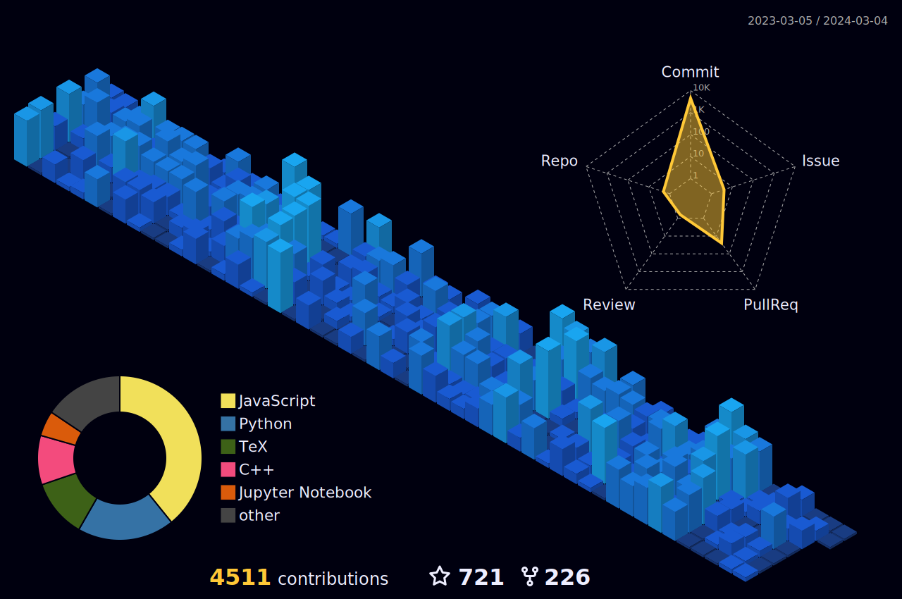

<!-- ppizarror README file -->
<!-- icons: https://github.com/alexandresanlim/Badges4-README.md-Profile -->

<h1 align="center">
  <a href="https://ppizarror.com">Hi there 👌 I'm Aman Raj</a>
</h1>

  I'm a fourth-year B.Tech CSE student specializing in web development, backed by a strong grasp of data structures and algorithms. Proficient in designing efficient algorithms, I excel in creating dynamic and interactive websites.

  
  
  

## 📊 Stats

<!-- 3D contribs -->
<picture>
  <source media="(prefers-color-scheme: light)" srcset="./profile-3d-contrib/profile-green.svg">
  
</picture>

  
More

   

  <!-- https://github.com/anuraghazra/github-readme-stats -->
  

    
  

  
  

## 💻 Languages

  
  
  
  
  
  
  

